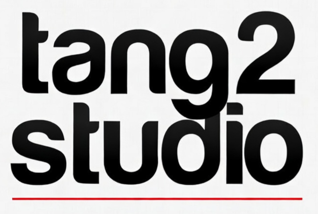

# 🎵 bachyyy — Tầng High Studio

<p align="center">
  
</p>

<p align="center">
  <em>“Studio is to be heard, not to be seen”</em>
  <br />
  <strong>Nâng tầm âm thanh. Định hình phong cách. Kích hoạt sáng tạo.</strong>
</p>

<p align="center">
  
  
  
  
</p>

---

## 📌 Giới thiệu (Overview)

**bachyyy** là website chính thức của **Bạch Quốc Anh (Bachyyy)** – Music Producer & Songwriter tại Việt Nam, đồng thời là cổng thông tin của **Tầng High Studio**.

**Tầng High Studio** là hệ sinh thái dịch vụ âm nhạc và sản xuất nội dung dành cho nghệ sĩ, nhà sáng tạo và thương hiệu hiện đại. Chúng tôi cung cấp giải pháp trọn gói từ ý tưởng, sản xuất âm nhạc, ghi hình đến phân phối và thương mại hóa sản phẩm sáng tạo.

---

## ✨ Dịch vụ & Tính năng (Features & Services)

### 1. 🎚️ Sản xuất & Xử lý Âm thanh
- **Sáng tác & Sản xuất nhạc theo yêu cầu:** Nhạc thương mại, ca khúc độc quyền, TVC/Jingle, nhạc phim.
- **Thu âm vocal chuyên nghiệp:** Không gian tiêu chuẩn âm học, thiết bị chuẩn studio.
- **Mixing & Mastering:** Tối ưu hóa độ cân bằng, độ chi tiết và âm lượng chuẩn quốc tế trên các nền tảng streaming (Spotify, Apple Music, YouTube).
- **Tune Vocal / Chỉnh Pitch:** Xử lý giọng hát tự nhiên hoặc hiệu ứng auto-tune hiện đại.
- **Sound Design & VFX:** Thiết kế âm thanh cho phim ngắn, quảng cáo, video nghệ thuật.

### 2. 🎹 Sản phẩm Âm nhạc cho Producer
- **Beat Store:** Cung cấp beat độc quyền (Exclusive) và không độc quyền (Lease).
- **Sample Packs & Sound Kits:** Bộ âm thanh độc bản, presets synthesizer, one-shots, drum kits được xử lý kỹ lưỡng.
- **Tài nguyên sản xuất:** Cung cấp project template và sound resources cho producers.

### 3. 🎧 Biểu diễn & Đào tạo
- **DJ biểu diễn sự kiện:** Đem năng lượng âm nhạc bùng nổ đến các sự kiện, club, festival.
- **Khóa học DJ 1:1:** Đào tạo kỹ năng thực chiến, làm chủ mixer/controller, tư duy setlist.
- **Đào tạo Music Production:** Lộ trình từ cơ bản đến nâng cao (nhạc lý hiện đại, beatmaking, mixing).
- **Tổ chức & Vận hành sự kiện:** Cung cấp giải pháp âm thanh và nội dung cho sự kiện âm nhạc.

### 4. 💻 Trải nghiệm Web Hiện đại
- **Intro Overlay Tương tác:** Nút tương tác DVD-bounce phong cách retro tích hợp trình phát audio độc đáo.
- **Giao diện Responsive:** Tối ưu hóa trải nghiệm mượt mà trên cả thiết bị di động (Mobile) và máy tính để bàn (Desktop).
- **Typography & Brand Identity:** Kết hợp typography tinh tế (`Gowun Batang`, `Inter`) mang phong cách tối giản và nghệ thuật.

---

## 🛠️ Công nghệ sử dụng (Tech Stack)

- **Framework:** [Next.js 16](https://nextjs.org/) (App Router, Turbopack)
- **Library:** [React 19](https://react.dev/)
- **Styling:** [Tailwind CSS v4](https://tailwindcss.com/) (`@tailwindcss/postcss`)
- **Ngôn ngữ:** [TypeScript](https://www.typescriptlang.org/)
- **Fonts:** [Gowun Batang](https://fonts.google.com/specimen/Gowun+Batang) (Local font) & Inter
- **Code Linter:** [ESLint 9](https://eslint.org/)

---

## 📁 Cấu trúc thư mục (Directory Structure)

```text
bachyyy/
├── app/
│   ├── favicon.ico
│   ├── globals.css         # Cấu hình styles Tailwind v4 & CSS biến toàn cục
│   ├── layout.tsx          # Root layout, nhúng font Gowun Batang & Header Nav
│   ├── page.tsx            # Trang chủ tổng hợp các section
│   ├── IntroOverlay.tsx    # Thành phần intro overlay tương tác âm thanh & hiệu ứng bounce
│   └── ui/
│       ├── nav.tsx         # Thanh điều hướng và logo Tầng High
│       ├── feature1.tsx    # Section Hero / Triết lý âm nhạc
│       ├── feature2.tsx    # Section Giới thiệu Studio & CTA Cards
│       └── feature3.tsx    # Section Hệ sinh thái dịch vụ (Chúng tôi làm gì?)
├── public/
│   ├── audio/              # File âm thanh nền demo
│   ├── fonts/              # Bộ font cục bộ Gowun Batang (Regular & Bold)
│   └── imgs/               # Logo, hình ảnh nghệ thuật, patterns & symbols
├── next.config.ts          # Cấu hình Next.js
├── postcss.config.mjs      # Cấu hình PostCSS với Tailwind v4
├── tsconfig.json           # Cấu hình TypeScript
└── package.json            # Scripts & dependencies
```

---

## 🚀 Hướng dẫn cài đặt & Khởi chạy (Getting Started)

### Yêu cầu hệ thống
- **Node.js**: >= 18.18.0 hoặc >= 20.x
- **Trình quản lý gói**: npm, yarn, pnpm hoặc bun

### Các bước cài đặt

1. **Clone repository:**
   ```bash
   git clone https://github.com/chrislethedimsum/bachyyy.git
   cd bachyyy
   ```

2. **Cài đặt thư viện:**
   ```bash
   npm install
   # hoặc
   yarn install
   # hoặc
   pnpm install
   ```

3. **Chạy máy chủ phát triển (Development Server):**
   ```bash
   npm run dev
   ```

4. **Truy cập ứng dụng:**
   Mở trình duyệt và truy cập [http://localhost:3000](http://localhost:3000).

---

## 📜 Các câu lệnh có sẵn (Scripts)

| Lệnh | Chức năng |
| :--- | :--- |
| `npm run dev` | Khởi chạy Next.js ở môi trường development (`next dev`) |
| `npm run build` | Đóng gói sản phẩm cho production (`next build`) |
| `npm run start` | Chạy production server sau khi đã build (`next start`) |
| `npm run lint` | Kiểm tra lỗi cú pháp và chuẩn code với ESLint (`eslint`) |

---

## 📞 Liên hệ & Đặt lịch (Contact)

- **Nghệ sĩ:** Bạch Quốc Anh (Bachyyy)
- **Studio:** Tầng High Studio
- **Dịch vụ:** Đặt lịch thu âm, mixing/mastering, beatmaking, hợp tác sản xuất âm nhạc & booking DJ.
